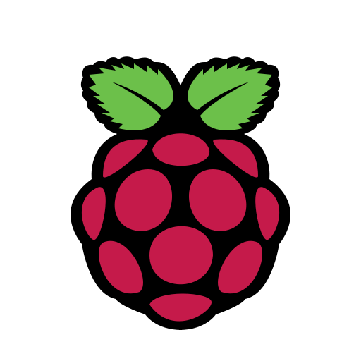

<h1 align="center">
  Hi there, I'm  Artem 
</h1>
  <h3 align="center">Math and mechanics student from Russia / Junior software developer  -----------------------------------------------------------------------</h3>

<h3 align = "left">Skills:</h3>

  
  
  
  
  
  <h3 align="center">  ----------------------------------------------------------------------- </h3>

<h3 align = "left">Stats:</h3>
  

  
  
  
  
   <h3 align="center">  ----------------------------------------------------------------------- </h3>

<h3 align = "left">Activity:</h3>

<!--
**Assppex/Assppex** is a ✨ _special_ ✨ repository because its `README.md` (this file) appears on your GitHub profile.

Here are some ideas to get you started:

- 🔭 I’m currently working on ...
- 🌱 I’m currently learning ...
- 👯 I’m looking to collaborate on ...
- 🤔 I’m looking for help with ...
- 💬 Ask me about ...
- 📫 How to reach me: ...
- 😄 Pronouns: ...
- ⚡ Fun fact: ...
-->
